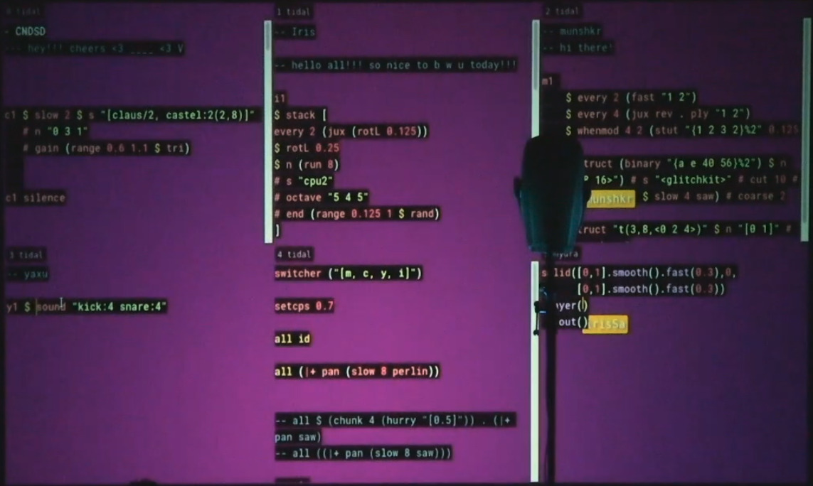

TidalCycles (or just Tidal for short) is software for making musical patterns with code, whether live coding music at algoraves or composing in the studio.
It includes a simple and flexible notation for rhythmic sequences, and an extensive library of patterning functions for combining and transforming them.
This allows you to quickly create complex patterns from simple ingredients.

Check out the [showcase](/introduction/showcase) to see what cool things people in the vibrant [community](/introduction/community) have made using Tidal.

You can learn Tidal through experimentation and play — most Tidal coders have little or no experience in software engineering.
To jump right in, you can try out TidalCycles online without installing anything by using [Estuary](https://estuary.mcmaster.ca/).

If you are familiar with JavaScript, you may want to check out [Strudel](https://strudel.cc), a port of Tidal to JavaScript. It also works directly in your browser!

## The concept

[TODO: Explain cycles and patterns]

## The components

To use Tidal you need a stack of components to translate your code into sound. What is called "TidalCycles" is technically only the top layer of this stack, a language and library embedded in the Haskell programing language.
Code is interpreted by the TidalCycles Library and sent to [SuperDirt](https://github.com/musikinformatik/SuperDirt), a synth and sampling engine, which runs in [SuperCollider](https://supercollider.github.io/), a programming language and audio server which produces the sounds.
Tidal uses SuperDirt by default, but can send control messages to anything that understands Open Sound Control (OSC) or MIDI messages.

The [guides](/guides/installation) on this website will explain how to set up and use this stack of interacting components.

## Contribute

If you enjoy using TidalCycles, please consider contributing to the [TidalCycles Open Collective crowdfunding project](https://opencollective.com/tidalcycles). From the project page:

> As the Tidal community grows, this opencollective fund will accept donations towards development and documentation initiatives for the project, and potentially artist development opportunities. The overall aims will be:
>
> - To develop free/open source software that reimagines computer programming as a live interface for musicians and other artists to creatively explore patterns.
> - To make the software more accessible, including through documentation, translation and design, and encourage contributions from more people
> - To foster a community of contributors and other users from diverse backgrounds.

Since Tidal is open source, anyone is also welcome to contribute to its development, [which takes place on GitHub](https://github.com/tidalcycles/tidal).
This documentation is [also on GitHub](https://github.com/tidalcycles/tidal-doc), and you don't need to be a software engineer to suggest improvements.

## Credits

TidalCycles and SuperDirt have been developed with contributions from a wide range of people - [Tidal contributors](https://github.com/tidalcycles/Tidal/graphs/contributors) / [SuperDirt contributors](https://github.com/musikinformatik/SuperDirt/graphs/contributors).

TidalCycles was initiated by Alex McLean around 2009 during doctoral work funded by EPSRC. Alex's ongoing work on Tidal has been supported in part by various ad hoc contributors, and grants (e.g. the [PENELOPE](https://penelope.hypotheses.org/) project, under the Horizon 2020 research and innovation programme of the European Union, grant agreement No 682711).

In 2021, Alex moved the project's public financial contribution support model from an individual/personal contribution type (via Ko-fi), to an Organisational Model via the [OpenCollective platform](https://opencollective.com/tidalcycles), at the same time appointing an experienced admin team to handle the ongoing project accounting in a transparent and ethical manner.

TidalCycles has been heavily inspired by the work of many others including Bernard Bel, Laurie Spiegel, and Adrian Ward.

## History

Tidal was originally made by [Alex McLean](https://tidalcycles.org/User:Yaxu) (who is writing this bit right now), while a postgrad student in Goldsmiths in London.
It started around 2006, with a DSL to explore pattern rotation presented at a 'pecha kucha' inspired event organised by Tom Carden in London ([video here](http://toxi.co.uk/blog/2006/07/ask-later-not-t-k-event.htm), from 15 minute mark, [slides here](http://slab.org/archive/20/20.pdf) and videos [here](http://slab.org/archive/20/pl.avi) (for `feedback.pl` precursor) and [here](http://slab.org/archive/20/hs.avi) (for the Haskell experiment)).
This was developed further in 2007 into a system for "computational creativity", used to analyse rhythmic continuation in sound poetry, using Kurt Schwitters' Ursonate as an example (see section 4.1 of my [MSc thesis](https://pdfs.semanticscholar.org/99ac/092d014aac16728912563975282e20039e19.pdf) for details).
Like the Bol Processor 2 (BP2) software it was inspired by, I started off making it for analysis of rhythmic structure, but quickly switched to making it for synthesis, i.e.
for making new musical structure.
I can't remember the first time I performed with it, probably not too long after that.
We lived fast back then!

A bit of backstory…
I was mainly performing as part of the band [slub](http://slub.org/) (which we started around the year 2000), and prior to that using a system I made for live coding in Perl called feedback.pl, which you can read about in my 2004 article [Hacking Perl in Nightclubs](https://www.perl.com/pub/2004/08/31/livecode.html/).
We were (and still are) part of an international live coding collective called [TOPLAP](https://toplap.org/).

Anyway I got hooked on exploring pattern with pure functional programming, and Tidal became pretty central to my [PhD thesis](http://slab.org/thesis/).
I was lucky enough to be in the position of spending those 3–4 years (2007-2011) reading around, thinking about and writing about what I thought I was doing with it.
As well as the afore-mentioned BP2, a short essay by [Laurie Spiegel about pattern language](http://retiary.org/ls/writings/musical_manip.html) was a huge influence, and I also dreamed of a [visuo-spatial interface](https://slab.org/colourful-texture/) for it which I still haven't found the time to properly follow up on.

From the start I'd always shared the code for Tidal under a free/open source license, and gave [my first talk on it in 2009](https://web.archive.org/web/20090826135406/www.londonhug.net/2009/08/18/next-meeting-alex-mclean-live-coding-music-with-haskell/), but it wasn't until 2013 I was invited to do a month's residency at Hangar Barcelona supported by L'ull cec that I really had time and pressure to start documenting Tidal.
It was there that I did my first proper workshop in TidalCycles, it was a fun time.

From there it wasn't long until [Mike Hodnick](http://kindohm.com/) discovered Tidal, and started his intensive '365 tidal patterns' project.
The first person to do something often gets the credit, but I like the idea that it's the [second person to get into something who's really making the leap](https://www.youtube.com/watch?v=fW8amMCVAJQ).
So thanks to Mike and all the amazing people who've followed in making Tidal their own.

[SuperDirt](https://github.com/musikinformatik/SuperDirt/) is also part of the story.
Julian Rohrhuber started this project in 2015, to replace the software sampler that came out of Slub with a souped-up version of it based in SuperCollider with all of the amazing audio processing stuff it offers.
Plus people like Lennart and Ben Gold for jumping into the source to add new features.
It really feels like a proper free/open source project now.

It's also great to see people like [Alexandra Cardenas](https://cargocollective.com/tiemposdelruido), [CNDSD](https://vimeo.com/cndsd), [Calum Gunn](http://www.calumgunn.com/), [Heavy Lifting](https://heavy-lifting.github.io/), [Yecto](https://yecto.github.io/), [Miri Kat](https://mirikat.bandcamp.com/releases), [Tadokoro](http://twitter.com/tadokoro), [Lil Data](http://lildata.co.uk/), among others (this could be a very long list which I probably shouldn't have started), taking Tidal into exciting new territory all the time.
