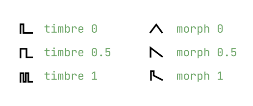
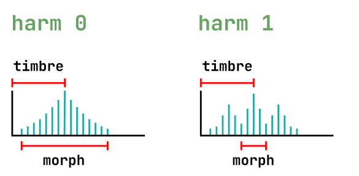
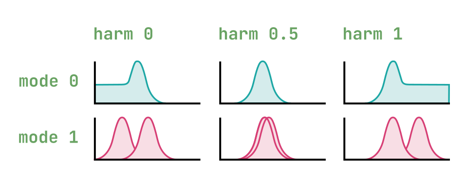

This list was adapted from the original [Plaits manual](https://pichenettes.github.io/mutable-instruments-documentation/modules/plaits/manual/), with some edits to match Tidal's parameter implementation.

The `engine` parameter (0-15) can be set to select one of the models listed below.

All engines accept the `harm`, `timbre` and `morph` parameters, which have specific ways to shape the sound in each engine. The original Plaits module has an additional AUX output which features a distinct rendering of the original sound; in Tidal, you can set the `mode` parameter to 1 to get the equivalent to the AUX output.

## 0: Pair of classic waveforms

Virtual-analog synthesis of classic waveforms.

| parameter | effect                          |
|-----------|---------------------------------|
| harm      | detuning between the two waves  |
| timbre    | variable square, from narrow pulse to full square to hardsync formants |
| morph     | variable saw, from triangle to saw with an increasingly wide notch (Braids’ CSAW) |
| mode 1    | sum of two hardsync’ed waveforms, the shape of which is controlled by `morph` and detuning by `harm`|

A narrow pulse or wide notch results in silence! Use this trick if you want to silence one of the two oscillators, to get a variable square or variable saw.

## 1: Waveshaping oscillator

An asymmetric triangle processed by a waveshaper and a wavefolder. Sounds familiar? That’s the same signal processing chain as in Tides, when it runs at audio rate!

| parameter | effect                          |
|-----------|---------------------------------|
| harm      | waveshaper waveform  |
| timbre    | wavefolder amount |
| morph     | waveform asymmetry |
| mode 1    | variant employing another wavefolder curve, as available in Warps|

## 2: Two operator FM

Two sine-wave oscillators modulating each other’s phase.

| parameter | effect |
|-----------|--------|
| harm      | frequency ratio  |
| timbre    | modulation index |
| morph     | feedback, in the form of operator 2 modulating its own phase (past 0.5, rough!) or operator 1’s phase (before 0.5, chaotic!) |
| mode 1    | sub-oscillator |

**Note:** Set `morph` to 0 to get the same range of sounds as Braids’ WTFM. Set it to 1 to recreate the same sounds as Braids’ FBFM. A gentler palette equivalent to Braids’ FM is found with `morph` at 0.5.

## 3: Granular formant oscillator

Simulation of formants and filtered waveforms through the multiplication, addition and synchronization of segments of sine waves.

| parameter | effect |
|-----------|--------|
| harm      | frequency ratio between formant 1 and 2  |
| timbre    | formant frequency |
| morph     | formant width and shape; this controls the shape of the window by which a sum of two synchronized sine oscillators is multiplied |
| mode 1    | simulation of filtered waveforms by windowed sine waves – a recreation of Braids’ Z*** models. `harm` controls the filter type (peaking, LP, BP, HP), with smooth variation from one response to another |

## 4: Harmonic oscillator

An additive mixture of harmonically-related sine waves.

| parameter | effect |
|-----------|--------|
| harm      | number of bumps in the spectrum; starts with one big bump, and progressively adds ripples around it |
| timbre    | index of the most prominent harmonic; this control is somewhat similar to the cutoff frequency of a band-pass filter |
| morph     | bump shape – from flat and wide to peaked and narrow; this control is somewhat similar to the resonance of a band-pass filter |
| mode 1    | variant including only the subset of harmonics present in the drawbars of a Hammond organ (frequency ratios of 1, 2, 3, 4, 6, 8, 10 and 12) |

## 5: Wavetable oscillator

Four banks of 8x8 waveforms, accessed by row and column, with or without interpolation.

| parameter | effect |
|-----------|--------|
| harm      | sets the active bank (read below) |
| timbre    | row index; within a row, the waves are sorted by spectral brightness (except for bank D which is a mess!) |
| morph     | column index |
| mode 1    | low-fi (5-bit) output |

There are 4 interpolated banks followed by the same 4 banks, in reverse order, without interpolation.

- Bank A: harmonically poor waveforms obtained by additive synthesis (sine harmonics, drawbar organ waveforms).
- Bank B: harmonically rich waveforms obtained by formant synthesis or waveshaping.
- Bank C: wavetables from the Shruthi-1 / Ambika, sampled from classic wavetable or ROM playback synths.
- Bank D: a joyous semi-random permutation of waveforms from the other 3 banks.

(TODO: make it clearer which values of `harm` select each bank, I didn't test)

## 6: Chords

Four-note chords, played by virtual analogue or wavetable oscillators. The virtual analogue oscillators emulate the stack of harmonically-related square or sawtooth waveforms generated by vintage string&organ machines.

| parameter | effect |
|-----------|--------|
| harm      | chord type |
| timbre    | chord inversion and transposition |
| morph     | waveform; values until 0.5 go through a selection of string-machine like raw waveforms (different combinations of the organ and string “drawbars”), and above 0.5 it scans a small wavetable containing 16 waveforms |
| mode 1    | root note of the chord |

The proper values for `harm` (chord type) are

|value|chord|
|-----|-----|
|0.00 - 0.08| octave |
|0.09 - 0.17| 5 |
|0.18 - 0.26| sus4 |
|0.27 - 0.36 | m |
|0.37 - 0.46 | m7 |
|0.47 - 0.56 | m9 |
|0.57 - 0.66 | m11 |
|0.67 - 0.75 | M 6/9 |
|0.76 - 0.85 | M9 |
|0.86 - 0.95 | M7 |
|0.96 - 1 | M |

## 7: Vowel and speech synthesis

A collection of speech synthesis algorithms.

| parameter | effect |
|-----------|--------|
| harm      | crossfades between formant filtering, SAM, and LPC vowels, then goes through several banks of LPC words |
| timbre    | species selection, from Daleks to chipmunks. How does it work? This parameter either shifts the formants up or down independently of the pitch; or underclocks/overclocks the emulated LPC chip (with appropriate compensation to keep the pitch unchanged) |
| morph     | phoneme or word segment selection. When `harm` is greater than (0.4? original docs say knob at 11o'clock), a list of words can be scanned through |
| mode 1    | unfiltered vocal cords’ signal |

## 8: Granular cloud

A swarm of 8 enveloped sawtooth waves.

| parameter | effect |
|-----------|--------|
| harm      | amount of pitch randomization |
| timbre    | grain density |
| morph     | grain duration and overlap; when set to 1, the grains merge into each other: the result is a stack of eight randomly frequency-modulated waveforms |
| mode 1    | variant with sine wave oscillators |

To get a nice “supersaw” waveform, try a moderate amount of pitch randomization and grain density, with full grain overlap.

## 9: Filtered noise

Variable-clock white noise processed by a resonant filter. The cutoff frequency of the filter is controlled by `freq`. This allows proper tracking!

| parameter | effect |
|-----------|--------|
| harm      | filter response, from LP to BP to HP |
| timbre    | clock frequency |
| morph     | filter resonance |
| mode 1    | variant employing two band-pass filters, with their separation controlled by `harm` |

## 10: Particle noise

Dust noise processed by networks of all-pass or band-pass filters.

| parameter | effect |
|-----------|--------|
| harm      | amount of frequency randomization |
| timbre    | particle density |
| morph     | filter type – reverberating all-pass network before 0.5, then increasingly resonant band-pass filters |
| mode 1    | raw dust noise |

## 11: Inharmonic string modeling

_No info on the original docs_

## 12: Modal resonator

For your own pleasure, a mini-Rings! Refer to the Rings section for more information about modulated/inharmonic string synthesis, and modal resonators.

When the TRIG input is not patched, the string/resonator is excited by dust (particle) noise. Otherwise, the string is excited by a short burst of filtered white noise, or by a low-pass filtered click. (FIXME: what does the TRIG input equate to in Tidal?)

| parameter | effect |
|-----------|--------|
| harm      | amount of inharmonicity, or material selection |
| timbre    | excitation brightness and dust density |
| morph     | decay time (energy absorption) |
| mode 1    | raw exciter signal |

Note that Plaits uses a less powerful processor than Rings, and is thus limited to 3 voices of polyphony in inharmonic string modeling mode, and 1 voice of polyphony with 24 partials in modal resonator mode. Plaits does not allow you to control the position of the excitation, which is set to 25% of the length of the string/bar/tube.

## 13: Analog bass drum model

No fancy acronyms or patented technology here… Just behavioral simulation of circuits from classic drum machines! The drum machine employs a bridged T-network excited by a nicely shaped pulse.

| parameter | effect |
|-----------|--------|
| harm      | attack sharpness and amount of overdrive |
| timbre    | brightness |
| morph     | decay time |
| mode 1    | frequency-modulated triangle VCO, turned into a sine with a pair of diodes, and shaped by a dirty VCA |

Without any signal patched to the TRIG input, a continuous tone is produced. Not particularly useful, but its amplitude can still be modulated by `morph` and CV input (FIXME: equivalent to CV input in Tidal?).

## 14: Analog snare drum model

The generator employs a bunch of bridged T-networks, one for each mode of the shell, excited by a nicely shaped pulse; plus some band-pass filtered noise. 

| parameter | effect |
|-----------|--------|
| harm      | balance of the harmonic and noisy components |
| timbre    | balance between the different modes of the drum |
| morph     | decay time |
| mode 1    | a pair of frequency-modulated sine VCO, mixed with high-pass filtered noise |

## 15: Analog hi-hat model

A bunch of square oscillators generate a harsh, metallic tone. The resulting signal is mixed with clocked noise, sent to a HPF, then to a VCA. It uses 6 square oscillators and a dirty transistor VCA.

| parameter | effect |
|-----------|--------|
| harm      | balance of the metallic and filtered noise |
| timbre    | high-pass filter cutoff |
| morph     | decay time |
| mode 1    | three pairs of square oscillators ring-modulating each other, and a clean, linear VCA |
